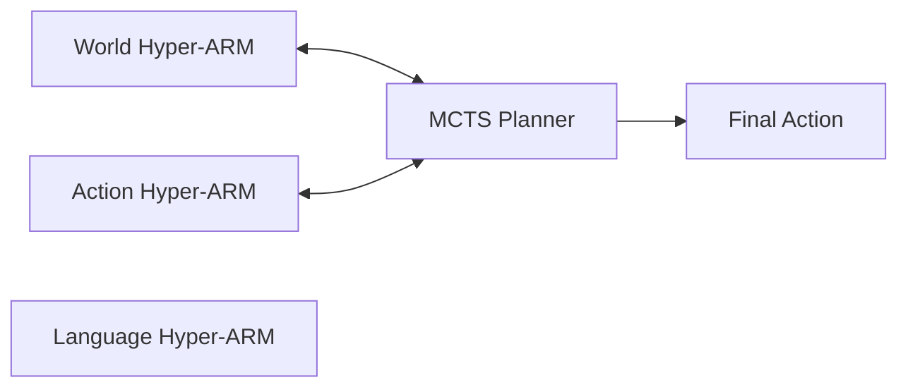

# Hyper-Associative-Recall-Memory

**Copyright 2026 @Streamlined Designs**  
**Licensed under the Apache License, Version 2.0**

## 🧠 Overview

This repository contains the **Hyper Query Encoder (HQE)**, the enture archicture of the **Hyper-ARM Cognitive Architecture**. 

Unlike traditional deep learning models that generate outputs from scratch, this system is a **computational simulation of cognition**. It grounds perception in memory, retrieves concepts via hyperspherical prototypes, and dynamically weights cognitive processes (Memory, Intuition, Reasoning) based on confidence.

This implementation serves as the **Vision/State Encoder** for the larger Hyper-ARM ecosystem, providing grounded state representations for World Modeling and Action Planning.

**Key Architectural Highlights:**
*   **Sparse Mixture of Latent Experts (SMoLE):** Every cognitive branch (QE, VE, DE, CE) operates as a conditional expert system.
*   **Extreme Parameter Efficiency:** Hypernetworks generate weights on-the-fly, minimizing stored parameters while maximizing computational capacity.
*   **Deep Computational Graph:** Despite efficiency, the multi-hop structure creates a computational depth of **200+ logical layers**.

---

## 🗺️ Cognitive Architecture Map

The HQE architecture maps specific code components to cognitive functions. This is not just metaphorical; the data flow is designed to mimic these processes computationally.

| Cognitive Function | Code Component | Description |
| :--- | :--- | :--- |
| **Vision** | `FrozenEncoderLayer` | Base frozen visual encoding. |
| **Context** | `Visual Centroids` | Global context vectors used to condition hypernetworks. |
| **Memory** | `QE Branch` (Query Encoder) | Retrieves relevant past experiences from LTM/STM. |
| **Intuition** | `VE Branch` (Value Encoder) | Rapid, heuristic value estimation based on state. |
| **Reasoning** | `DE Branch` (Directional Encoder) | Analogical Reasoning (DPAD). |
| **Meta-Attention** | `CE Branch` (Control Encoder) | Dynamically weights QE, VE, and DE outputs based on confidence. |
| **Concepts** | `Hyperspherical Prototypes` | Fixed semantic anchors in embedding space (Classes). |
| **Confidence** | `STM/LTM Weighting` | Dynamic weighting between Short-Term and Long-Term memory. |
| **Learning** | `Prototype Alignment Loss` | Learns to map states to conceptual prototypes. |
| **Specialization** | **SMoLE Branches** | Each branch acts as a Sparse Mixture of Latent Experts. |

---

## 🦾 The Hyper-ARM Ecosystem

In the full Hyper-ARM architecture, perceptual stimuli feed into three Hyper-ARM blocks connected by MCTS (Monte Carlo Tree Search).



### 1. World Hyper-ARM (Future Module)
*   **Stores:** `(State, Action) → Next State` transitions.
*   **Function:** Given the current state (from HQE) and a considered action, it retrieves similar past transitions from memory to compose a predicted next state.
*   **Grounding:** Predictions are retrieved from memory, not hallucinated by a generator.

### 2. Action Hyper-ARM (Future Module)
*   **Stores:** `State → Action` mappings.
*   **Function:** Given the current state, it retrieves relevant past actions to compose action tendencies.

### 3. Language Hyper-ARM (Future Module)
*   **Stores:** `Language → Action` mappings.
*   **Function:** Given the language, it retrieves relevant past actions to compose action tendencies.

### 3. MCTS Planner
*   Sits between the World and Action blocks.
*   Uses the World model to simulate futures and the Action model to select optimal paths.

---

## ⚙️ Key Features

### 1. Sparse Mixture of Latent Experts (SMoLE)
Every cognitive branch in the HQE is implemented as a **Sparse Mixture of Latent Experts**.
*   **Conditional Computation:** Instead of static weights, hypernetworks generate unique weights for every forward pass based on context (Centroids for QE/VE/CE, Support Kernels for DE).
*   **Specialization:** This allows each branch to act as a dynamic expert, activating different "latent pathways" depending on the input context.
*   **Efficiency:** Because weights are generated rather than stored, the model achieves high representational capacity with a fraction of the stored parameters of a dense network.

### 2. Extreme Computational Depth (200+ Layers)
Despite its parameter efficiency, the model achieves immense computational depth through its multi-hop, multi-branch structure.
*   **Multi-Hop Refinement:** 4 Hops × 4 Branches (QE, VE, DE, CE).
*   **Sub-Layer Depth:** Each hop contains Residual CNNs, Hypernetworks, and Dynamic Target Networks.
*   **Total Depth:** When counting sub-layers and logical operations across all hops and branches, the computational graph exceeds **200 logical layers**, allowing for complex feature refinement without the vanishing gradient issues of traditional deep networks (due to residual connections and normalization).

### 3. DPAD Ensemble (Directional Prototype Alignment Decoding)
The model uses a 3-branch ensemble weighted by a 4th control branch:
*   **QE (Memory):** Retrieves neighbor prototypes from Memory Bank.
*   **VE (Intuition):** Generates value vectors via hypernetworks.
*   **DE (Reasoning):** Refines attention weights over neighbors using relational kernels.
*   **CE (Meta-Attention):** Learns to trust QE, VE, or DE based on context temperature.

### 4. Hyperspherical Concept Space
*   **Prototypes:** Classes are represented as fixed, evenly distributed vectors on a hypersphere.
*   **Repulsion Loss:** Prototypes are optimized to maximize pairwise distance, ensuring distinct conceptual boundaries.
*   **Persistence:** Prototype mappings (Dataset → Class → Prototype) are saved in a Look-Up Table (LUT) across runs.

### 5. Continuous Memory (STM & LTM)
*   **LTM (Long-Term Memory):** Persistent ChromaDB collection. Seeded via optimization before training. Uses FIFO eviction when capacity (`8192`) is reached.
*   **STM (Short-Term Memory):** Optimized during training on error cases. Acts as a "working memory" buffer for difficult samples.
*   **Dynamic Weighting:** The model automatically shifts reliance from LTM to STM when confidence in LTM retrieval drops below a threshold.

---

## 🚀 Installation

Run the install.sh script 1 command at a time.

---

## 🏃 Usage

### Training & Evaluation
Run the main script to execute the full pipeline (Seeding → Training → STM Optimization → Evaluation).

```bash
python hqe_encoder_script.py
```

Continuous Training 

```bash
./run_continuous_training_loop.sh
```

### Grid Search
To run hyperparameter optimization on STM/LTM weighting and thresholds:
1.  Set `HYPERPARM_GRID_SEARCH = True` in the configuration.
2.  Select parameters in `params_to_include`.
3.  Run the script multiple times (index is auto-incremented).

### Ablation Studies
Toggle cognitive branches to test their contribution:
```python
USE_VE_BRANCH = False   # Disable Intuition
USE_DE_BRANCH = False   # Disable Reasoning
USE_CE_BRANCH = False   # Disable Meta-Attention (Fixed Weighting)
```

### Persistence
The system automatically saves/loading the following between runs:
*   Model Weights & Optimizer State (including Learning Rate).
*   Visual Centroids (Context).
*   Hyperspherical Prototypes (Concepts).
*   Prototype Mapping LUT.
*   LTM & STM Databases (with FIFO eviction).

---

## 📂 File Structure

```text
./
├── hqe_encoder_script.py       # Main source code
├── chroma_db_mnist/            # LTM Database (Persistent)
├── chroma_db_stm/              # STM Database (Persistent)
├── saved_hqe_hyper_multi_hop_full.keras  # Model Architecture + Weights
├── saved_hqe_hyper_multi_hop_optimizer.keras # Optimizer State
├── saved_visual_centroids.npy  # Context Centroids
├── saved_hyperspherical_prototypes.npy # Concept Anchors
└── prototype_mapping_lut.json  # Dataset -> Concept Map
```

---

## 🧠 Cognitive Philosophy

### Grounded Prediction
Traditional generative models hallucinate outputs based on statistical likelihood. Hyper-ARM grounds predictions in **retrieved memory**. If the system predicts a state or action, it is because it has composed it from similar past experiences stored in LTM/STM.

### Confidence as Control
The `CE Branch` (Meta-Attention) acts as a confidence mechanism. If the `QE Branch` (Memory) is uncertain (low similarity), the system dynamically increases the weight of the `STM` (Working Memory) or shifts reliance to `VE` (Intuition) or `DE` (Reasoning). This mimics cognitive resource allocation under uncertainty.

### Conceptual Stability
By using **Hyperspherical Prototypes**, the system maintains stable conceptual boundaries even as the encoder evolves. The model learns to map varying visual inputs to fixed conceptual anchors, preventing catastrophic forgetting during continuous learning.

### Efficiency via Specialization
The **Sparse Mixture of Latent Experts** design ensures that the model does not waste capacity on irrelevant features. By generating weights conditionally based on context, the model activates only the necessary computational pathways for a given input, mirroring the energy efficiency of biological neural systems.

---

## 📄 License

Licensed under the Apache License, Version 2.0 (the "License");
you may not use this file except in compliance with the License.
You may obtain a copy of the License at

   http://www.apache.org/licenses/LICENSE-2.0

Unless required by applicable law or agreed to in writing, software
distributed under the License is distributed on an "AS IS" BASIS,
WITHOUT WARRANTIES OR CONDITIONS OF ANY KIND, either express or implied.
See the License for the specific language governing permissions and
limitations under the License.

**Copyright 2026 @Streamlined Designs**